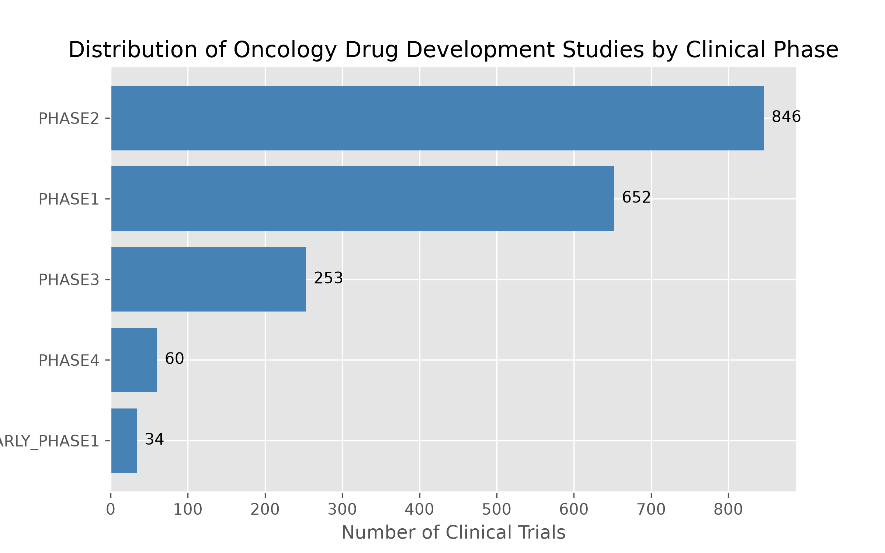
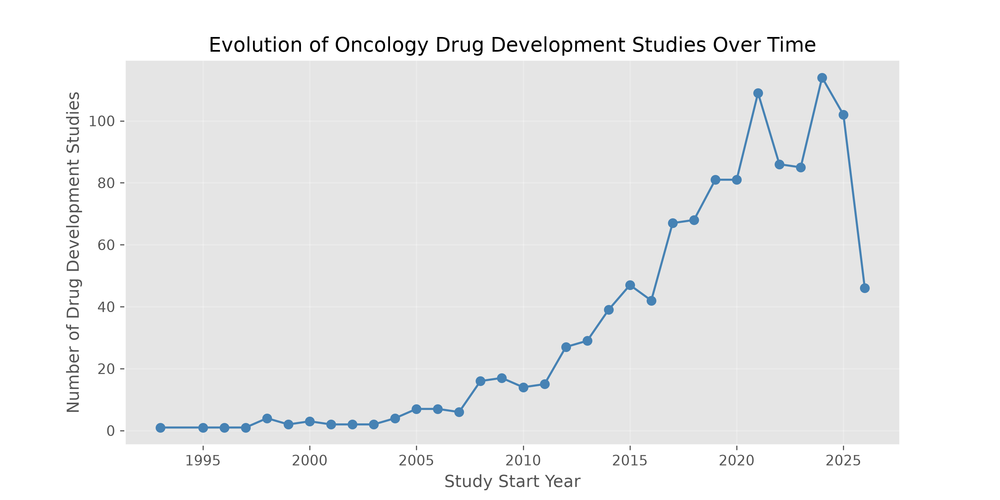
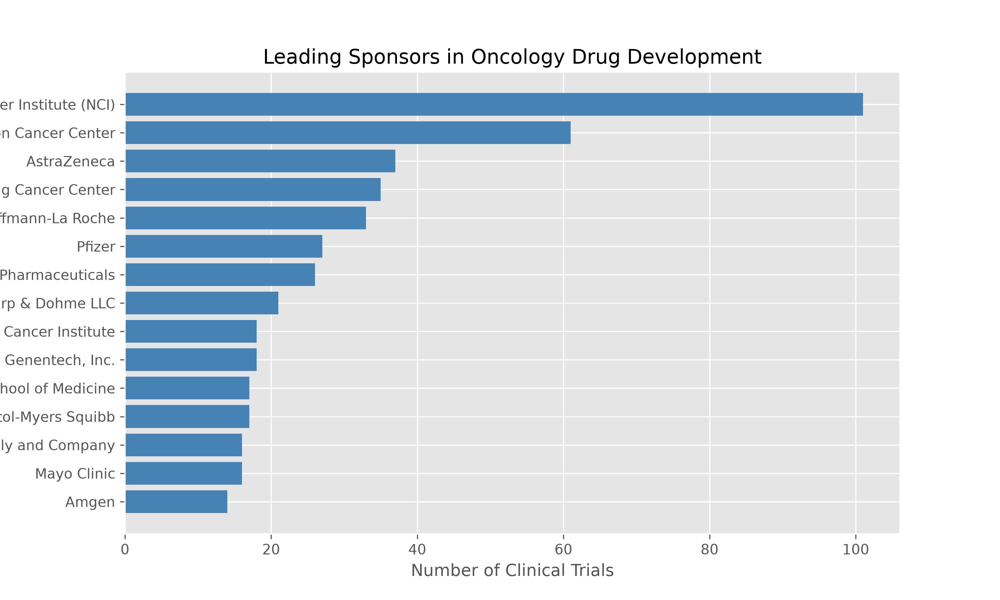
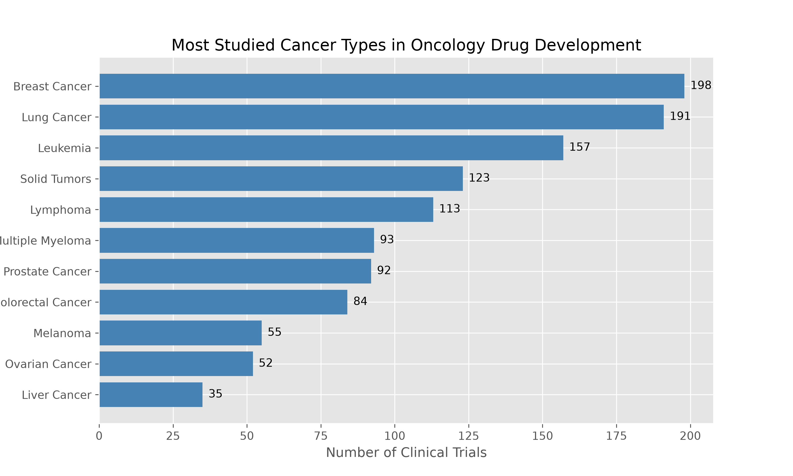
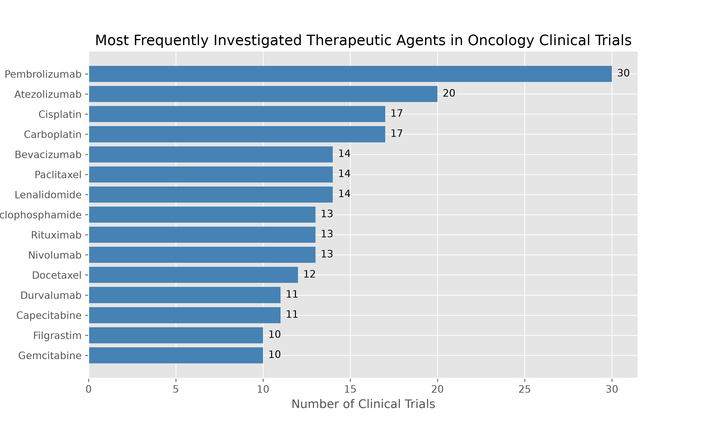
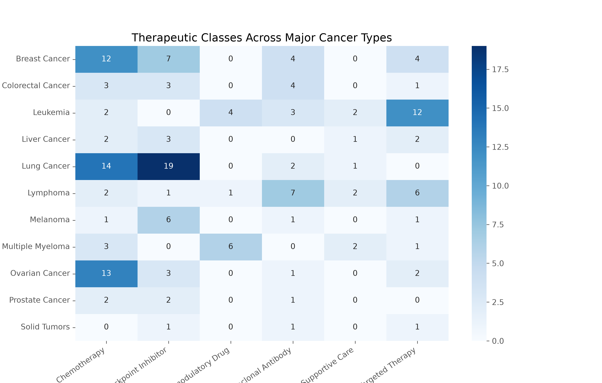

<h1 style="color:black;">Oncology Clinical Trials Landscape</h1>

Exploratory analysis of oncology clinical trials with a focus on drug development using data retrieved directly from the ClinicalTrials.gov API.

This project investigates global trends in oncology drug development, including clinical trial phases, temporal evolution, leading sponsors, cancer types, therapeutic agents, and therapeutic strategies across different malignancies.

---

<h2 style="color:steelblue;">Highlights</h2>

- Retrieved clinical trial data directly from the ClinicalTrials.gov REST API.
- Built a custom data extraction pipeline using Python and Requests.
- Cleaned and standardized heterogeneous clinical trial metadata.
- Performed exploratory analysis of over 2,500 oncology drug development studies.

---

<h2 style="color:steelblue;">Project Objectives</h2>

The main objectives of this project are:

- Analyze the distribution of oncology clinical trials across clinical phases.
- Explore temporal trends in oncology drug development.
- Identify the leading organizations sponsoring oncology studies.
- Characterize the most frequently investigated cancer types.
- Investigate the therapeutic agents most commonly evaluated in oncology.
- Compare therapeutic strategies across major cancer types.

---

<h2 style="color:steelblue;">Dataset</h2>

Data were obtained directly from the **ClinicalTrials.gov REST API**.

A custom Python function was developed to retrieve oncology-related studies using keyword-based searches and API pagination.

For this analysis:

- **3,000 oncology clinical studies** were downloaded.
- Studies involving **drug interventions** were retained.

---

<h2 style="color:steelblue;">Technologies used</h2>

- Python
- Pandas
- NumPy
- Matplotlib
- Seaborn
- Requests
- ClinicalTrials.gov API

---

<h2 style="color:steelblue;">Key Analyses</h2>

The notebook includes the following analyses:

<h3 style="color:#6BAED6;">Clinical Phase Distribution</h3>

Evaluation of the distribution of oncology drug development studies across clinical phases.

---

<h3 style="color:#6BAED6;">Temporal Trends</h3>

Analysis of changes in oncology clinical trial activity over time.

---

<h3 style="color:#6BAED6;">Leading Sponsors</h3>

Identification of the organizations most actively involved in oncology drug development.

---

<h3 style="color:#6BAED6;">Cancer Type Distribution</h3>

Comparison of the most frequently investigated cancer types.

---

<h3 style="color:#6BAED6;">Most Frequent Therapeutic Agents</h3>

Analysis of the drugs most commonly evaluated in oncology clinical trials.

---

<h3 style="color:#6BAED6;">Therapeutic Classes</h3>

Distribution of therapeutic classes investigated across oncology studies.

---

<h3 style="color:#6BAED6;">Therapeutic Strategies Across Cancer Types</h3>

Heatmap illustrating how therapeutic classes vary across major cancer types.

---

<h2 style="color:steelblue;">Main Findings</h2>

- Phase II represented the largest group of oncology drug development studies.
- Oncology clinical trial activity increased substantially after 2015.
- Research is driven by a combination of industry sponsors, academic institutions and governmental organizations.
- Breast cancer, lung cancer and hematologic malignancies account for a large proportion of ongoing therapeutic development.
- Immune checkpoint inhibitors are among the most frequently investigated therapeutic approaches.
- Therapeutic strategies differed markedly across cancer types, with immunotherapy dominating several solid tumors, while hematologic malignancies displayed distinct therapeutic profiles.

---

<h2 style="color:steelblue;">Future Improvements</h2>

Potential extensions of this project include:

- Drug name normalization using biomedical ontologies.
- Network analysis of combination therapies.
- Integration with FDA drug approval data.
- Interactive dashboards using Plotly or Tableau.
- Machine learning approaches for clinical trial outcome prediction.

---

<h2 style="color:steelblue;">Author</h2>
Maria Luz Acevedo

Biology undergraduate with interests in Clinical Research, Clinical Data Analytics and Bioinformatics.

GitHub: https://github.com/marialuzacevedo

LinkedIn: https://www.linkedin.com/in/marialuzacevedo